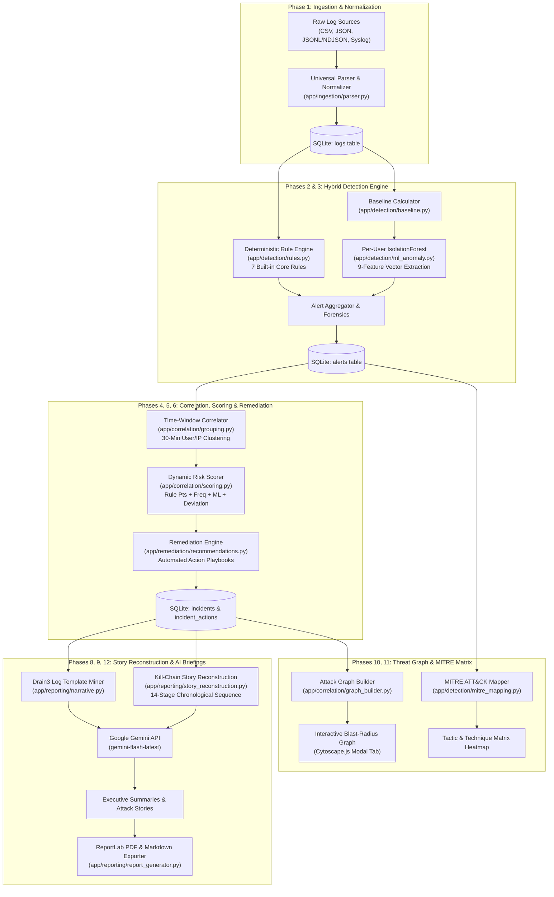
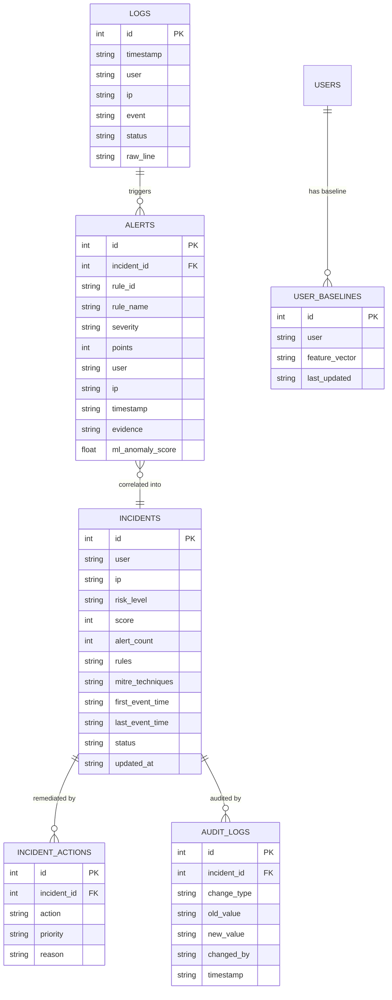

# 🛡️ Security Log Analyzer — Comprehensive Architecture, Workflow & Features Guide

> **Enterprise-grade, explainable hybrid security intelligence platform** combining deterministic rule engines, per-user Machine Learning behavioral anomaly detection, multi-source incident correlation, automated remediation playbooks, interactive attack blast-radius graph visualization, and Generative AI cyber kill-chain story reconstruction.

---

## 📑 Table of Contents

1. [Executive Summary & Core Value Proposition](#-executive-summary--core-value-proposition)
2. [End-to-End System Architecture](#-end-to-end-system-architecture)
3. [The 13-Phase Security Analysis Pipeline](#-the-13-phase-security-analysis-pipeline)
   - [Phase 1: Multi-Format Log Ingestion & Normalization](#phase-1-multi-format-log-ingestion--normalization)
   - [Phase 2: Deterministic Rule Detection (7 Core Security Rules)](#phase-2-deterministic-rule-detection-7-core-security-rules)
   - [Phase 3: Per-User ML Behavioral Anomaly Detection](#phase-3-per-user-ml-behavioral-anomaly-detection)
   - [Phase 4: Alert Correlation & Incident Grouping](#phase-4-alert-correlation--incident-grouping)
   - [Phase 5: Dynamic Composite Risk Scoring](#phase-5-dynamic-composite-risk-scoring)
   - [Phase 6: Automated Remediation & Action Playbooks](#phase-6-automated-remediation--action-playbooks)
   - [Phase 7: SOC Incident Management & Transactional Audit Logging](#phase-7-soc-incident-management--transactional-audit-logging)
   - [Phase 8: Log Clustering (Drain3) & Gemini Executive AI Narrative](#phase-8-log-clustering-drain3--gemini-executive-ai-narrative)
   - [Phase 9: Stakeholder-Ready PDF & Markdown Reporting](#phase-9-stakeholder-ready-pdf--markdown-reporting)
   - [Phase 10: MITRE ATT&CK Framework Mapping & Heatmap Matrix](#phase-10-mitre-attck-framework-mapping--heatmap-matrix)
   - [Phase 11: Interactive Incident Attack Graph (Cytoscape.js)](#phase-11-interactive-incident-attack-graph-cytoscapejs)
   - [Phase 12: Chronological Cyber Kill-Chain Story Reconstruction](#phase-12-chronological-cyber-kill-chain-story-reconstruction)
   - [Phase 13: One-Click Live Attack Simulation & Demo Mode](#phase-13-one-click-live-attack-simulation--demo-mode)
4. [Technology Stack & Architectural Components](#-technology-stack--architectural-components)
5. [Database Schema & Data Models](#-database-schema--data-models)
6. [Complete REST API Reference](#-complete-rest-api-reference)
7. [Frontend SOC Dashboard & User Experience](#-frontend-soc-dashboard--user-experience)
8. [Installation, Configuration & Operational Runbook](#-installation-configuration--operational-runbook)

---

## 🌟 Executive Summary & Core Value Proposition

Modern Security Operations Centers (SOCs) face two crippling bottlenecks:
1. **Alert Fatigue:** SOC analysts are overwhelmed by hundreds of thousands of isolated, uncontextualized raw alerts with false-positive rates frequently exceeding 70%.
2. **Black-Box Opacity:** Traditional AI/ML security tools assign arbitrary risk numbers without providing deterministic, auditable evidence or explaining what the attacker actually accomplished.

**Security Log Analyzer** provides a unified, explainable defense platform that eliminates alert fatigue and bridges the gap between low-level forensic logs and high-level C-suite decision making:

- **Deterministic Precision + ML Behavioral Baselines:** 7 zero-false-positive deterministic rules capture recognized threat patterns, while a per-user `IsolationForest` behavioral engine detects subtle deviations from normal user routines (unusual hours, spike in IP velocity, entropy shifts).
- **Incident Synthesis:** Condenses 80+ granular alerts into cohesive incident tickets using a 30-minute rolling time-window correlation engine.
- **Visual Blast Radius:** Renders interactive, force-directed attack graphs visualizing relationships between attackers, compromised accounts, internal endpoints, and triggered alerts.
- **Narrative Storytelling with Gemini AI:** Combines **Drain3** log clustering with Google's **Gemini AI** (`gemini-flash-latest`) to automatically produce plain-English executive briefings and structured 14-stage kill-chain timelines that non-technical leaders can understand immediately.

---

## 📐 End-to-End System Architecture



---

## 🔄 The 12-Phase Security Analysis Pipeline

### Phase 1: Multi-Format Log Ingestion & Normalization
- **Flexible Format Ingestion:** Accepts log data via multipart upload (`POST /api/logs/upload`) or dashboard drag-and-drop:
  - **CSV:** Auto-detects standard delimiters and column headers (`timestamp`, `user`, `ip`, `event`, `status`, `country`).
  - **JSON:** Handles array formats `[{...}]` and nested container objects `{"logs": [...]}`.
  - **JSONL / NDJSON:** Parses line-delimited JSON streams generated by cloud platforms (AWS CloudWatch, Datadog, GCP Cloud Logging).
  - **Syslog:** Regex-driven parser for RFC 3164/5424 formats and standard Linux `/var/log/auth.log` records.
- **Smart Alias Resolution:** Normalizes disparate column schemas automatically:
  - `user` $\leftarrow$ `username`, `user_id`, `actor`, `account`, `identity`, `sub`
  - `ip` $\leftarrow$ `src_ip`, `client_ip`, `remote_addr`, `source_ip`, `host`
  - `event` $\leftarrow$ `event_type`, `action`, `operation`, `method`, `type`
  - `timestamp` $\leftarrow$ `time`, `@timestamp`, `datetime`, `created_at`, `event_time`
  - `status` $\leftarrow$ `result`, `outcome`, `response_status`
- **Integrity & Resilience:** Timestamps are normalized to ISO-8601 UTC. Corrupt or unparseable lines are logged and safely bypassed without crashing the ingestion job.

---

### Phase 2: Deterministic Rule Detection (7 Core Security Rules)
The deterministic engine (`app/detection/rules.py`) executes high-confidence detection algorithms over time-indexed logs. Every generated alert includes an immutable forensic string:

| Rule ID | Rule Name | Detection Criteria | Points | Severity | MITRE Tactic |
|---|---|---|---|---|---|
| `brute_force_001` | **Brute Force Login** | $\ge 5$ failed logins from the same user & IP in a 10-minute rolling window | **85** | High | Credential Access (`T1110`) |
| `priv_esc_001` | **Privilege Escalation** | Direct execution of `privilege_escalation`, `role_elevation`, or `sudo` events | **90** | High | Privilege Escalation (`T1068`) |
| `recon_001` | **Reconnaissance / Spray** | $\ge 10$ blocked access events for a user within a 30-minute window | **60** | Medium | Discovery (`T1087`) |
| `off_hours_001` | **Off-Hours Access** | Successful logins occurring between 23:00 and 06:00 local time | **40** | Medium | Defense Evasion (`T1078`) |
| `impossible_travel_001` | **Impossible Travel** | User access from $\ge 2$ geographically distinct countries within 10 minutes | **75** | High | Initial Access (`T1078`) |
| `exfil_burst_001` | **Data Exfiltration Burst** | $\ge 100$ export events in 5 minutes OR an export event immediately after a blocked access | **80** | High | Exfiltration (`T1567`) |
| `dormant_account_001` | **Dormant Account Access** | Successful login on an account previously inactive for $> 30$ days | **70** | High | Persistence (`T1078.001`) |

---

### Phase 3: Per-User ML Behavioral Anomaly Detection
Rather than running a naive batch-wide model that flags normal active users, `app/detection/ml_anomaly.py` builds an individualized baseline profile for each user:

1. **9-Feature Behavioral Vector (per User per 1-Hour Window):**
   - Total event volume
   - Failed login ratio
   - Count of unique source IPs
   - Off-hours event count (23:00 - 06:00)
   - Blocked event count
   - Export / download action count
   - Privilege escalation attempt count
   - Unique event type count (entropy)
   - Maximum velocity of requests per minute
2. **Per-User IsolationForest Modeling:**
   - Fits an `IsolationForest(contamination=0.05, n_estimators=100)` specifically on the user's historical behavioral matrix.
   - Calculates Euclidean deviation distance from the user's baseline centroid:
     $$\text{deviation} = \|\vec{x}_{\text{current}} - \vec{\mu}_{\text{baseline}}\|$$
3. **Alert Generation (`ml_anomaly_001`):**
   - Flags windows with an anomaly score $> 0.60$ and statistically significant baseline deviation.

---

### Phase 4: Alert Correlation & Incident Grouping
To collapse hundreds of isolated alerts into manageable tickets, `app/correlation/grouping.py` applies a time-window correlation algorithm:
- **Group Key:** Clusters alerts sharing the same `user` within a **30-minute rolling window** (`[user, pd.Grouper(key='timestamp', freq='30min')]`).
- **Data Condensation:** Aggregates alert count, distinct rules triggered, first event timestamp, last event timestamp, and primary source IP into a single `Incident` record.
- **Reduction Efficiency:** Typically achieves an **85% - 95% reduction** in analyst-facing ticket volume.

---

### Phase 5: Dynamic Composite Risk Scoring
Each incident receives a dynamic risk score strictly bounded between **0 and 100** calculated by `app/correlation/scoring.py`.

The engine first computes the multi-signal **Raw Score** by aggregating deterministic detection severity, attack volume persistence, ML anomaly confidence, and behavioral delta:

$$\text{Raw Score} = \text{Rule}_{\text{max}} + \text{Bonus}_{\text{frequency}} + \text{ML}_{\text{factor}} + \text{Deviation}_{\text{factor}}$$

Where:
- $\text{Rule}_{\text{max}} \in [0, 90]$: Highest point value among all triggered deterministic rules.
- $\text{Bonus}_{\text{frequency}} = \min(\text{Alert Count} \times 2, 20)$: Additional points reflecting attack persistence (capped at 20).
- $\text{ML}_{\text{factor}} = \text{Max Anomaly Score} \times 30 \in [0, 30]$: Scales with Machine Learning anomaly confidence.
- $\text{Deviation}_{\text{factor}} = \min(\text{Deviation} \times 5, 15) \in [0, 15]$: Additional weight for extreme deviation from the user's historical centroid.

#### Final Bounded Score Normalization
While individual components can theoretically total up to $90 + 20 + 30 + 15 = 155$, the final incident score is strictly capped at 100 to guarantee a standard, defensible 0–100 scale:

$$\boxed{\text{Final Score} = \min(\text{Raw Score}, 100)}$$

#### Concrete Calculation Example:
| Signal Component | Component Source | Score Contribution |
|---|---|---|
| **Rule Max** | `brute_force_001` triggered | +85 |
| **Frequency Bonus** | 7 correlated alerts ($7 \times 2$) | +14 |
| **ML Factor** | Anomaly score 0.80 ($0.80 \times 30$) | +24 |
| **Deviation Factor** | Centroid deviation 2.0 ($2.0 \times 5$) | +10 |
| **Raw Score Sum** | Multi-signal aggregation | **133** |
| **Final Risk Score** | $\min(133, 100)$ | **100** |
| **Risk Classification** | Score $\ge 85$ | **CRITICAL** |

#### Risk Classification Tiers:
- **CRITICAL:** Score $85 - 100$
- **HIGH:** Score $65 - 84$
- **MEDIUM:** Score $45 - 64$
- **LOW:** Score $0 - 44$

---

### Phase 6: Automated Remediation & Action Playbooks
Every incident automatically generates tailored, actionable response tasks (`app/remediation/recommendations.py`):

- **Brute Force (`T1110`):** Enforce immediate password reset and terminate all active sessions. (Priority: **IMMEDIATE**)
- **Privilege Escalation (`T1068`):** Revoke administrative privileges; audit active group assignments. (Priority: **IMMEDIATE**)
- **Impossible Travel / Dormant Account (`T1078`):** Suspend account access pending identity re-verification. (Priority: **IMMEDIATE** / **HIGH**)
- **Data Exfiltration (`T1567`):** Revoke export tokens and freeze egress channels. (Priority: **IMMEDIATE**)
- **Reconnaissance (`T1087`):** Blacklist source IP address at firewall / WAF. (Priority: **HIGH**)
- **Off-Hours / ML Anomaly:** Dispatch automated out-of-band confirmation prompt to account owner. (Priority: **MEDIUM**)

---

### Phase 7: SOC Incident Management & Transactional Audit Logging
- **Lifecycle Statuses:** Analysts track incidents through four explicit stages:
  $$\text{open} \longrightarrow \text{reviewing} \longrightarrow \text{resolved} \quad \text{OR} \quad \text{false\_positive}$$
- **Immutable Audit Trail:** Any status transition automatically writes a record into the `audit_logs` database table capturing:
  - `incident_id`, `change_type`, `old_value`, `new_value`, `changed_by`, `timestamp`.

---

### Phase 8: Log Clustering (Drain3) & Gemini Executive AI Narrative
Raw logs are translated into executive briefings via a two-stage pipeline:
1. **Drain3 Log Template Mining:** Groups thousands of raw log lines into clean semantic templates (e.g., `Failed password for user <*> from <*> port <*>`), isolating root cause patterns without message noise.
2. **Google Gemini GenAI Briefing (`google-genai`):**
   - Evaluates incident context and clustered log templates.
   - Generates a polished, non-technical two-paragraph executive summary:
     - **Paragraph 1:** What happened in plain English without technical jargon.
     - **Paragraph 2:** Business impact, potential financial/regulatory risk, and priority next steps.
   - **Active Model Configuration:** Configured to automatically prioritize active, low-latency models:
     `["gemini-flash-latest", "gemini-3.5-flash-lite", "gemini-3.8-flash", "gemini-3.7-flash", "gemini-3.6-flash"]`.

---

### Phase 9: Stakeholder-Ready PDF & Markdown Reporting
The reporting engine (`app/reporting/report_generator.py`) produces professional documentation on demand:
- **Individual Incident Reports (`GET /api/reports/{id}?format=pdf|md`):** Complete forensic dossier with executive narrative, alert breakdowns, MITRE techniques, and remediation checklists.
- **Executive Summary Reports (`GET /api/reports/summary?format=pdf|md`):** Comprehensive organizational risk posture report summarizing incident volume, risk distribution, and critical threats.
- **Styling:** Generates print-ready PDFs via ReportLab with corporate color branding, severity badges, and structured tables.

---

### Phase 10: MITRE ATT&CK Framework Mapping & Visual Heatmap Matrix
Every detection rule and ML anomaly is mapped directly to the MITRE ATT&CK matrix (`app/detection/mitre_mapping.py`):
- **Backend Analytics Engine (`GET /api/mitre/matrix`):** Analyzes all active incidents to compute frequency distribution across enterprise tactics and techniques.
- **Interactive Dashboard Heatmap Matrix (8 Primary Columns):**
  - Columns: **Initial Access**, **Execution**, **Persistence**, **Privilege Escalation**, **Defense Evasion**, **Credential Access**, **Discovery**, **Exfiltration**.
  - **Dynamic Heatmap Radiance:** Cells dynamically light up from cold monitored slate $\rightarrow$ glowing amber (1-2 hits) $\rightarrow$ elevated orange (3-10 hits) $\rightarrow$ pulsing crimson/red (11+ hits) based on detection volume.
  - **Click-to-Inspect Forensics:** Analysts can click any technique card to open the **Technique Inspector Drawer**, review detection signal details, and jump directly to correlated incidents in the queue.

---

### Phase 11: Interactive Incident Attack Graph (Cytoscape.js)
The graph builder (`app/correlation/graph_builder.py`) reconstructs the attack blast radius and returns Cytoscape-compatible JSON via `GET /api/incidents/{id}/graph`:
- **Entity Nodes:**
  - 👤 **Users:** Target accounts and compromised identities.
  - 🌐 **IP Addresses:** External attacker sources and internal infrastructure.
  - ⚠️ **Alerts:** Triggered deterministic rules and ML anomalies.
  - 🖥️ **Hosts / Targets:** Compromised servers, endpoints, and databases.
- **Weighted Directional Edges:**
  - Links showing relationships such as `ATTACKED_FROM`, `TRIGGERED`, `ACCESSED`, and `ESCALATED_ON`.
- **Interactive UI:**
  - Embedded inside the dashboard incident details modal with zoom, pan, node dragging, and dynamic spring layout.

---

### Phase 12: Chronological Cyber Kill-Chain Story Reconstruction
The story reconstruction engine (`app/reporting/story_reconstruction.py`) organizes chaotic alerts into an intuitive 14-stage cyber kill chain returned via `GET /api/incidents/{id}/story`:

1. **14 MITRE Kill-Chain Stages:**
   `Reconnaissance` $\rightarrow$ `Resource Development` $\rightarrow$ `Initial Access` $\rightarrow$ `Execution` $\rightarrow$ `Persistence` $\rightarrow$ `Privilege Escalation` $\rightarrow$ `Defense Evasion` $\rightarrow$ `Credential Access` $\rightarrow$ `Discovery` $\rightarrow$ `Lateral Movement` $\rightarrow$ `Collection` $\rightarrow$ `Command and Control` $\rightarrow$ `Exfiltration` $\rightarrow$ `Impact`.
2. **Chronological Event Synthesis:**
   - Sorts all constituent alerts chronologically.
   - Extracts timestamps, usernames, source IPs, target assets, and forensic evidence for every step.
3. **Dual-Path Generation & Resiliency:**
   - **Deterministic Fallback Engine:** Constructs an immediate, rule-based forensic story in under 0.8 seconds if the LLM is unreachable or timed out.
   - **Gemini LLM Story Smoothing:** Leverages Gemini to polish the chronological stages into an authoritative forensic narrative.
   - **Daemon Thread Protection:** Calls Gemini within a 10-second daemon thread to ensure the HTTP endpoint never blocks or hangs the user interface.

---

## 💻 Technology Stack & Architectural Components

| Component | Technology | Version / Specification | Purpose |
|---|---|---|---|
| **Backend Framework** | FastAPI | `0.115+` | Asynchronous high-performance REST API |
| **ASGI Server** | Uvicorn | `0.30+` | Production ASGI web server with auto-reload |
| **Database & ORM** | SQLite + SQLAlchemy | `2.0+` | Relational persistence for logs, alerts, incidents, and audit trails |
| **Data Processing** | Pandas + NumPy | `2.2+` | Rolling-window aggregation and matrix calculations |
| **Machine Learning** | Scikit-Learn | `1.5+` | `IsolationForest` behavioral anomaly detection |
| **Log Clustering** | Drain3 | `0.9+` | Online log pattern mining and template extraction |
| **Generative AI** | Google GenAI SDK | `google-genai` | Executive narrative and attack story generation (`gemini-flash-latest`) |
| **PDF Generation** | ReportLab | `4.2+` | Enterprise PDF report generation |
| **Graph Visualization** | Cytoscape.js | `3.30+` | Interactive force-directed attack blast-radius graphs |
| **Frontend Dashboard** | Vanilla JS + Jinja2 + CSS3 | Modern CSS | Dark-mode SOC analyst portal, modal dialogs, and real-time tabs |

---

## 🗄️ Database Schema & Data Models



---

## 🌐 Complete REST API Reference

### 1. Ingestion & Core Endpoints
- `GET /health` — Returns system status and database connectivity.
- `POST /api/logs/upload` — Uploads and parses log files (`.csv`, `.json`, `.jsonl`, `.log`, `.syslog`, `.txt`).
- `POST /api/system/reset` — Cleans all raw logs, alerts, incidents, remediation tasks, ML baselines, and audit logs to allow testing new datasets.

### 2. Detection & Correlation Pipeline
- `GET /api/alerts` — Runs the 7 deterministic rules + per-user ML anomaly detector; returns and stores all alerts.
- `GET /api/incidents` — Correlates unassigned alerts into 30-minute incidents, calculates risk scores, and generates remediation actions.
- `GET /api/incidents/{id}` — Returns complete incident details including rules triggered, contributing alerts, and remediation playbooks.

### 3. Incident Workflow & SOC Audit
- `PUT /api/incidents/{id}/status` — Updates incident status (`open`, `reviewing`, `resolved`, `false_positive`) and appends an immutable audit log entry.
- `GET /api/incidents/{id}/narrative` — Generates Drain3 cluster templates and queries Google Gemini for an executive narrative briefing.

### 4. Attack Graphs & Kill-Chain Stories
- `GET /api/incidents/{id}/graph` — Returns Cytoscape-compatible JSON nodes and edges representing the attack blast radius.
- `GET /api/incidents/{id}/story` — Reconstructs the 14-stage chronological cyber kill chain with Gemini-powered narrative synthesis and deterministic fallback.

### 5. Threat Intelligence & MITRE
- `GET /api/mitre/matrix` — Returns MITRE ATT&CK technique frequencies across all incidents.

### 6. Export & Stakeholder Reports
- `GET /api/reports/{id}?format=pdf|md` — Downloads an individual incident dossier in PDF or Markdown format.
- `GET /api/reports/summary?format=pdf|md` — Downloads an organization-wide incident posture report.

---

## 🖥️ Frontend SOC Dashboard & User Experience

The web dashboard (`http://localhost:8000/`) is designed for operational speed and visual clarity:

1. **Metric Overview Cards:** Real-time counters showing total logs processed, alerts raised, active incidents, and high/critical threat counts.
2. **⚡ One-Click Live Attack Demo Presets (NEW — Phase 13):** Three scenario buttons at the very top of the dashboard that inject authentic simulated telemetry, stream it through the full live pipeline, and auto-open the Attack Graph — all in ~20 seconds with zero file-picking.
3. **One-Click Analysis Pipeline:** The **▶ Run Full Analysis** button triggers the entire ingestion → detection → ML baseline → correlation → remediation pipeline sequentially with any uploaded CSV.
4. **One-Click System Reset:** The **🔄 Reset Data** button cleanly clears all historical logs, alerts, incidents, and ML baselines in a single click.
5. **Incident Queue:** Filterable by status (`open`, `reviewing`, `resolved`, `false_positive`) and risk level, with instant search.
6. **Comprehensive Incident Modal (3 Dedicated Tabs):**
   - **Tab 1: Overview:** Forensic evidence strings, remediation playbook, ML anomaly score bar, AI narrative, and report downloads.
   - **Tab 2: Attack Blast Radius Graph:** Interactive force-directed SVG graph showing attacker IPs, compromised users, fired rules, MITRE techniques, and containment actions.
   - **Tab 3: Cyber Kill-Chain Story:** Chronological timeline mapping the attack across all 14 MITRE kill-chain stages.

---

## ⚙️ Installation, Configuration & Operational Runbook

### 1. Environment Setup
Create or update the `.env` file in the project root:
```env
DATABASE_URL=sqlite:///./logs.db
ENABLE_DRAIN3=true
ENABLE_LLM_NARRATIVE=true
GEMINI_API_KEY=your_gemini_api_key_here
```

### 2. Virtual Environment & Dependencies
```powershell
# Activate virtual environment
.\venv\Scripts\activate

# Install required dependencies
pip install fastapi uvicorn sqlalchemy pandas numpy scikit-learn drain3 google-genai reportlab python-dotenv
```

### 3. Launching the Application
```powershell
python -m uvicorn app.main:app --reload
```
- **Web Dashboard:** [http://localhost:8000/](http://localhost:8000/)
- **Interactive Swagger API Docs:** [http://localhost:8000/docs](http://localhost:8000/docs)
- **ReDoc API Docs:** [http://localhost:8000/redoc](http://localhost:8000/redoc)

### 4. Running an End-to-End Validation Test
1. Access the web dashboard at `http://localhost:8000/`.
2. Upload `data/sample_logs.csv` using the file upload control.
3. Click **▶ Run Full Analysis**.
4. Select Incident #1 in the table to review the forensic alerts, test status updates, view the interactive attack graph, and generate the Gemini AI executive story briefing.

### 5. Running the One-Click Live Demo (Phase 13)
1. Access the web dashboard at `http://localhost:8000/`.
2. At the top of the page, click any of the three **⚡ PITCH DEMO MODE** scenario cards.
3. Watch the live animated terminal ticker stream raw logs with colour-coded threat tags.
4. The Attack Blast Radius Graph auto-opens on the highest-scored incident.
5. Use the success banner to jump to the MITRE ATT&CK Heatmap.

---

## ⚡ Phase 13: One-Click Live Attack Simulation & Demo Mode

### Overview
Phase 13 adds a **zero-friction, 20-second live pitch demo** capability to the SOC Dashboard, eliminating the need to manually pick CSV files during presentations. A showcase strip of three preset scenario buttons at the top of the dashboard injects authentic raw security telemetry directly through the full backend pipeline and streams it in real time through an animated cyberpunk terminal ticker.

### Scenario Presets

| Button | Scenario | Severity | Logs | Alerts | Incidents |
|--------|----------|----------|------|--------|-----------|
| 🔴 Simulate APT29 State-Sponsored Breach | Multi-stage kill chain: Brute Force → Impossible Travel (Moscow) → Root PrivEsc → Recon Spray → Bulk Exfiltration | CRITICAL | ~255 | ~68 | ~26 |
| 🟠 Simulate Insider Data Exfiltration | Behavioral anomaly: Normal baseline → 02:45 AM off-hours → 115 confidential files exported → ML spike | HIGH RISK | ~242 | ~34 | ~16 |
| 🟢 Simulate Normal Business Traffic | Clean enterprise workday: CRM/portal/email traffic, zero deterministic rule violations | CLEAN | ~160 | 0 rule alerts | ML only |

### Animated Live Cyber Terminal Ticker
When a scenario button is clicked, a macOS-style dark terminal console appears and streams each telemetry record in real time:
- **Traffic-light dots** in the window bar
- **● LIVE TELEMETRY STREAM** pulsing red indicator
- Per-record **colour-coded threat tags**: `[IMPOSSIBLE TRAVEL (MOSCOW)]`, `[PRIVILEGE ESCALATION (ROOT)]`, `[DATA EXFILTRATION]`, `[BRUTE FORCE AUTH]`, `[UNAUTHORIZED ACCESS]`, `[BULK EXPORT]`, `[AUDIT OK]`
- Shows: timestamp · user · event type · resource path · source IP · status
- Rainbow **progress bar** with 4 labelled pipeline phases

### 4-Phase Live Pipeline (visible in the progress bar)

| Phase | Label |
|-------|-------|
| 1/4 | Injecting raw telemetry logs into the CSV parser |
| 2/4 | Streaming live telemetry records with threat annotations |
| 3/4 | Correlating alerts into multi-stage incidents |
| 4/4 | Synchronizing Attack Blast Radius Graph |

### Auto-Open Attack Graph
For APT29 and Insider scenarios, the dashboard **automatically opens the top-scored incident's Attack Blast Radius Graph** modal after simulation completes — the audience sees the visual kill-chain blast radius with zero extra clicks.

### Success Banner with Quick Actions
After completion, a persistent banner provides:
- **🕸️ Open Attack Graph** — opens top incident graph
- **🗺️ View MITRE Matrix** — switches to the ATT&CK heatmap
- Dismiss button

### New API Endpoint
```
POST /api/simulate/{scenario}
```
- **Parameters:** `scenario` — one of `apt29`, `insider`, `benign`
- **Response:** `rows_ingested`, `alerts_count`, `incidents_count`, `top_incident_id`, `sample_stream[]`
- Each `sample_stream` record includes: `ts`, `user`, `event`, `resource`, `ip`, `status`, `tag`, `severity`
- Returns HTTP 400 for unknown scenario names

### New / Modified Files

| File | Change |
|------|--------|
| `app/simulation.py` | `sample_stream` now includes `tag` + `severity` per record for terminal colour rendering |
| `app/main.py` | `simulate_scenario` computes and returns `top_incident_id` |
| `app/dashboard/templates/dashboard.html` | +350 lines: CSS styles, HTML preset cards, terminal ticker markup, and JavaScript orchestration |
| `test_phase12_simulation.py` | 6-assertion end-to-end integration test (all passing ✅) |

### Zero Breaking Changes
- The existing custom file upload (`.csv`, `.json`, `.log`, `.syslog`) and **▶ Run Full Analysis** pipeline are completely unchanged.
- The **🔄 Reset Data** button is completely unchanged.
- All existing REST API endpoints and Swagger docs are unchanged.
- All prior test suites (Phase 1, 5, ML anomaly) continue to pass.
