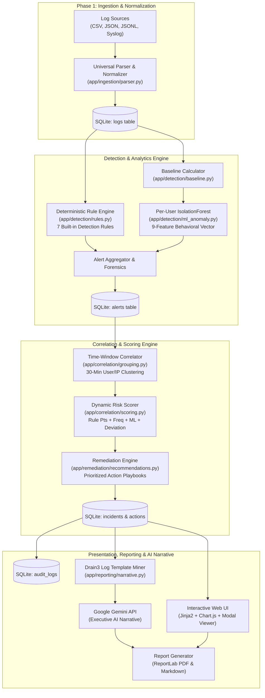
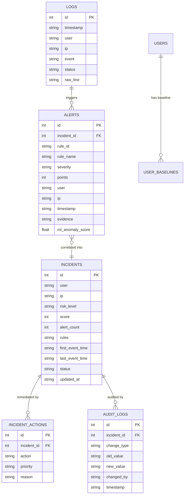

# 🛡️ Security Log Analyzer — Comprehensive Architecture & Workflow Guide

An enterprise-grade, explainable hybrid security intelligence platform combining **deterministic rule engines**, **per-user Machine Learning behavioral anomaly detection**, **incident correlation**, **automated remediation playbooks**, and **Generative AI executive narratives**.

---

## 📑 Table of Contents

1. [System Overview & Value Proposition](#-system-overview--value-proposition)
2. [High-Level System Architecture](#-high-level-system-architecture)
3. [End-to-End Workflow Pipeline](#-end-to-end-workflow-pipeline)
   - [Phase 1: Multi-Format Log Ingestion & Normalization](#phase-1-multi-format-log-ingestion--normalization)
   - [Phase 2: Deterministic Rule Detection (7 Core Rules)](#phase-2-deterministic-rule-detection-7-core-rules)
   - [Phase 3: Per-User ML Behavioral Anomaly Detection](#phase-3-per-user-ml-behavioral-anomaly-detection)
   - [Phase 4: Alert Correlation & Incident Grouping](#phase-4-alert-correlation--incident-grouping)
   - [Phase 5: Dynamic Composite Risk Scoring](#phase-5-dynamic-composite-risk-scoring)
   - [Phase 6: Automated Remediation & Playbooks](#phase-6-automated-remediation--playbooks)
   - [Phase 7: SOC Incident Management & Audit Logging](#phase-7-soc-incident-management--audit-logging)
   - [Phase 8: Log Clustering (Drain3) & Gemini AI Narrative](#phase-8-log-clustering-drain3--gemini-ai-narrative)
   - [Phase 9: Stakeholder-Ready PDF & Markdown Reporting](#phase-9-stakeholder-ready-pdf--markdown-reporting)
4. [Technology Stack & Key Libraries](#-technology-stack--key-libraries)
5. [Database Schema & Data Models](#-database-schema--data-models)
6. [Complete REST API Reference](#-complete-rest-api-reference)
7. [Setup, Deployment & Configuration](#-setup-deployment--configuration)

---

## 🌟 System Overview & Value Proposition

Traditional Security Information and Event Management (SIEM) systems suffer from two major problems:
1. **Alert Fatigue:** SOC analysts are flooded with thousands of disconnected alerts with high false-positive rates.
2. **Black-Box Opacity:** Pure ML tools generate risk scores without transparent, defensible evidence.

**Security Log Analyzer** solves both challenges by fusing:
- **Zero-False-Positive Deterministic Rules:** Known attack vectors trigger instant, high-confidence alerts with forensic evidence strings.
- **Per-User IsolationForest ML Modeling:** Rather than ranking users against a single batch, the model builds a baseline of each user's unique normal activity (login hours, IP spread, action frequencies) and flags genuine personal deviations.
- **Explainable Correlation Engine:** Collapses 80+ isolated alerts within 30-minute windows into prioritized incident tickets.
- **Executive-Ready AI Summaries:** Employs **Drain3** log template mining and **Google Gemini AI** (`gemini-2.5-flash`) to generate human-readable executive incident briefings without technical jargon.

---

## 📐 High-Level System Architecture



---

## 🔄 End-to-End Workflow Pipeline

### Phase 1: Multi-Format Log Ingestion & Normalization
- **File Detection:** Ingests log files through `POST /api/logs/upload` or via the web dashboard. Automatically sniffs and detects:
  - **CSV:** Headers such as `timestamp`, `user`, `ip`, `event`, `status`, `country`.
  - **JSON:** Array of objects `[{...}]` or nested structures `{"logs": [...]}`.
  - **JSONL / NDJSON:** Line-delimited JSON objects commonly produced by cloud aggregators (AWS CloudWatch, Datadog, GCP Logging).
  - **Syslog:** RFC 3164/5424 syslog streams and standard Linux `/var/log/auth.log` lines with regex-based parsing.
- **Smart Field Mapping:** Automatically recognizes alias variants:
  - `user`: `username`, `user_id`, `actor`, `account`, `identity`, `sub`
  - `src_ip`: `ip`, `client_ip`, `remote_addr`, `source_ip`, `host`
  - `event_type`: `action`, `event`, `operation`, `method`, `type`
  - `timestamp`: `time`, `@timestamp`, `datetime`, `created_at`, `event_time`
  - `status`: `result`, `outcome`, `response_status`
- **Resilience:** Invalid or malformed rows are safely logged and skipped without breaking ingestion. Timestamps are coerced to ISO UTC.

---

### Phase 2: Deterministic Rule Detection (7 Core Rules)
The rule engine (`app/detection/rules.py`) runs across the time-indexed dataset to identify unambiguous threat behaviors:

| Rule ID | Rule Name | Detection Criteria | Points | Severity |
|---|---|---|---|---|
| `brute_force_001` | **Brute Force Login** | $\ge 5$ failed logins from the same user & IP in a 10-minute rolling window | **85** | High |
| `priv_esc_001` | **Privilege Escalation** | Direct execution of `privilege_escalation` or `role_elevation` events | **90** | High |
| `recon_001` | **Reconnaissance / Spray** | $\ge 10$ blocked access events for a user within a 30-minute window | **60** | Medium |
| `off_hours_001` | **Off-Hours Access** | Successful logins occurring between 23:00 and 06:00 local time | **40** | Medium |
| `impossible_travel_001` | **Impossible Travel** | User access from $\ge 2$ geographically distinct countries within 10 minutes | **75** | High |
| `exfil_burst_001` | **Data Exfiltration Burst** | $\ge 100$ export events in 5 minutes OR an export event immediately after a blocked access | **80** | High |
| `dormant_account_001` | **Dormant Account Access** | Successful login on an account inactive for $> 30$ days | **70** | High |

*Every generated alert contains an immutable forensic evidence string specifying exact times, counts, and IP addresses.*

---

### Phase 3: Per-User ML Behavioral Anomaly Detection
Rather than running a single batch-wide IsolationForest that causes score distortion, `app/detection/ml_anomaly.py` implements a **per-user baseline model**:

1. **Feature Vector Extraction (9 Metrics per User per 1-Hour Window):**
   - Total event count
   - Failed login ratio
   - Count of unique source IPs used
   - Off-hours event count (23:00 - 06:00)
   - Blocked event count
   - Export / download action count
   - Privilege escalation attempt count
   - Unique event type count (entropy)
   - Max velocity of requests per minute
2. **Baseline Learning & Isolation Forest:**
   - Evaluates each user's behavioral vector across windows.
   - For users with historical baselines, fits an `IsolationForest(contamination=0.05, n_estimators=100)`.
   - Computes Euclidean distance against the user's historical centroid:
     $$\text{deviation} = \|\vec{x}_{\text{current}} - \vec{\mu}_{\text{baseline}}\|$$
3. **Anomaly Flagging:**
   - Windows with decision function anomaly scores $> 0.60$ and significant baseline deviations generate `ml_anomaly_001` alerts.

---

### Phase 4: Alert Correlation & Incident Grouping
To eliminate alert fatigue, `app/correlation/grouping.py` processes all unassigned alerts:
- **Group Key:** Combines alerts belonging to the **same user** within a **30-minute rolling window** (`[user, pd.Grouper(key='timestamp', freq='30min')]`).
- **Reduction Ratio:** Translates dozens of granular alerts into a single cohesive incident record.
- **Incident Meta:** Tracks `first_event_time`, `last_event_time`, primary IP address, aggregate alert count, and combined list of triggered rules.

---

### Phase 5: Dynamic Composite Risk Scoring
Each incident is evaluated via a multi-factor dynamic scoring formula (`app/correlation/scoring.py`):

$$\text{Score} = \text{Rule}_{\text{max}} + \text{Bonus}_{\text{frequency}} + \text{ML}_{\text{factor}} + \text{Deviation}_{\text{factor}}$$

- $\text{Rule}_{\text{max}}$: Highest point value among all triggered deterministic rules (0 - 90).
- $\text{Bonus}_{\text{frequency}} = \min(\text{Alert Count} \times 2, 20)$: Rewards detection depth for coordinated attacks.
- $\text{ML}_{\text{factor}} = \text{Max Anomaly Score} \times 30$: Scales based on ML model confidence (0 - 30).
- $\text{Deviation}_{\text{factor}} = \min(\text{Deviation} \times 5, 15)$: Adds up to 15 points for extreme deviation from user baseline.

#### Risk Level Tier Mapping:
- **Critical:** Score $\ge 85$
- **High:** Score $65 - 84$
- **Medium:** Score $45 - 64$
- **Low:** Score $< 45$

---

### Phase 6: Automated Remediation & Playbooks
Every incident automatically generates tailored, actionable remediation steps mapped directly from the fired rules (`app/remediation/recommendations.py`):

- **Brute Force:** Force immediate password reset and mandate Multi-Factor Authentication (MFA). (Priority: **IMMEDIATE**)
- **Privilege Escalation:** Revoke unauthorized elevated roles; notify account manager. (Priority: **IMMEDIATE**)
- **Impossible Travel / Dormant Account:** Lock account session pending identity verification. (Priority: **IMMEDIATE** / **HIGH**)
- **Exfiltration Burst:** Suspend data export permissions; initiate forensic data audit. (Priority: **IMMEDIATE**)
- **Reconnaissance / Spray:** Rate-limit or drop source IP at firewall/WAF. (Priority: **HIGH**)
- **Off-Hours / ML Anomaly:** Dispatch automated user confirmation prompt; review behavioral delta. (Priority: **MEDIUM**)

---

### Phase 7: SOC Incident Management & Audit Logging
- Analysts can inspect evidence in the dashboard modal and adjust status:
  - `open` ➔ `reviewing` ➔ `resolved` OR `false_positive`
- **Transactional Audit Trail:** Any status update writes an immutable entry into the `audit_logs` table recording:
  - Incident ID, Old status, New status, Timestamp, Analyst/User identity.

---

### Phase 8: Log Clustering (Drain3) & Gemini AI Narrative
For executive reporting, technical raw logs are distilled into leadership summaries:
1. **Drain3 Template Mining:** Analyzes raw log streams and clusters them into structured log templates (e.g. `User <*>` logged in from `<*>`), reducing thousands of repetitive lines down to key patterns.
2. **Google Gemini Generative AI:** Using the Google GenAI SDK (`google-genai` with model `gemini-2.5-flash`), the clustered logs and incident metadata are formatted into a prompt requesting:
   - **Paragraph 1:** Plain-English explanation of the suspicious event without technical jargon.
   - **Paragraph 2:** Real-world business impact and risk assessment tailored for C-level executives.

---

### Phase 9: Stakeholder-Ready PDF & Markdown Reporting
The reporting engine (`app/reporting/report_generator.py`) generates:
- **Single Incident Reports:** Detailed breakdown with risk badges, timeline, forensic evidence list, and remediation checklists.
- **Organization-Wide Summary Reports:** Aggregates all open incidents, overall risk distribution charts, and critical vulnerability callouts.
- **Dual Export Formats:**
  - **Clean Markdown (`.md`):** For technical documentation, Jira tickets, and GitHub issues.
  - **Executive PDF (`.pdf`):** Styled via ReportLab with corporate headers, risk-colored badges, clean tabular data, and formal typography.

---

## 💻 Technology Stack & Key Libraries

| Layer | Component / Library | Purpose |
|---|---|---|
| **API Framework** | FastAPI + Uvicorn | High-performance asynchronous REST API backend |
| **ORM & Database** | SQLAlchemy + SQLite | Relational schema modeling and ACID-compliant storage |
| **Data Processing** | Pandas + NumPy | Fast rolling-window calculations and vector manipulations |
| **Machine Learning** | Scikit-Learn | `IsolationForest` behavioral anomaly detection |
| **Log Clustering** | Drain3 | Log template mining and pattern compression |
| **Generative AI** | `google-genai` (Google AI Studio) | Executive incident briefings using Gemini models |
| **PDF Generation** | ReportLab | Programmatic, high-resolution PDF document rendering |
| **Frontend UI** | Jinja2 + Chart.js + Vanilla CSS | Real-time dark-mode SOC dashboard and incident modal viewer |

---

## 🗄️ Database Schema & Data Models



---

## 🌐 Complete REST API Reference

### Ingestion & Health
- `GET /health` — Verifies API health status.
- `POST /api/logs/upload` — Multipart file upload supporting `.csv`, `.json`, `.jsonl`, `.ndjson`, `.log`, `.syslog`, `.txt`.

### Detection & Correlation
- `GET /api/alerts` — Executes the 7 deterministic rules and per-user ML anomaly detector; persists alerts.
- `GET /api/incidents` — Groups unassigned alerts into candidate incidents, evaluates dynamic scores, and attaches remediation actions.
- `GET /api/incidents/{id}` — Returns full incident details (evidence strings, rules fired, contributing alerts, remediation items).

### Incident Workflow & Audit
- `PUT /api/incidents/{id}/status` — Updates status (`open`, `reviewing`, `resolved`, `false_positive`) and appends an audit log record.
- `GET /api/incidents/{id}/narrative` — Generates Drain3 cluster patterns and queries Google Gemini for an executive narrative.

### Reports Export
- `GET /api/reports/{id}?format=pdf|md` — Exports single incident report as PDF or Markdown.
- `GET /api/reports/summary?format=pdf|md` — Exports organization-wide incident posture report.

---

## ⚙️ Setup, Deployment & Configuration

### 1. Environment Setup
Create a `.env` file in the project root:
```env
# Google Gemini API key for Executive AI Narratives
GEMINI_API_KEY=your_actual_gemini_api_key_here
```

### 2. Dependency Installation
```powershell
# Activate virtual environment
.\venv\Scripts\activate

# Install required packages
pip install -r requirements.txt
pip install google-genai reportlab drain3 pandas scikit-learn
```

### 3. Running the Application
```powershell
python -m uvicorn app.main:app --reload
```
- **Web Dashboard:** [http://localhost:8000/](http://localhost:8000/)
- **Swagger Documentation:** [http://localhost:8000/docs](http://localhost:8000/docs)

### 4. Running the Complete E2E Pipeline
1. Open the web dashboard at `http://localhost:8000/`.
2. Upload any test file (`data/sample_logs.csv` or any JSON/syslog file) using the upload widget.
3. Click **▶ Run Full Analysis** to execute Ingestion ➔ Detection ➔ ML Baselines ➔ Correlation ➔ Remediation.
4. Click any incident in the table to review evidence, update status, generate AI narrative briefings, and download PDF reports.
